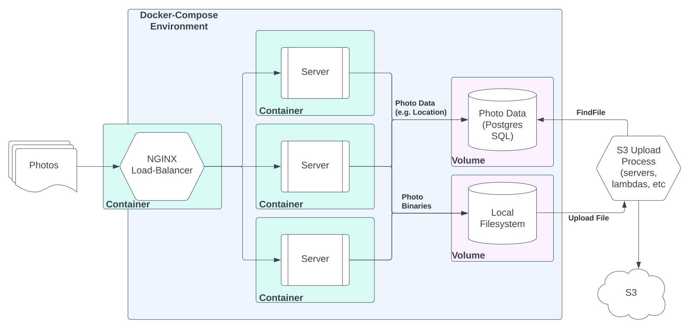

# Bowery Farming - Coding Assignment

<!-- markdownlint-disable MD033-->
<p align="center">
  <a href="https://boweryfarming.com/">
    
  </a>

  <h3 align="center">On-Premise Photo Uploader App</h3>

  <p align="center">
    A local API server that allows for uploading of images for eventual S3 backup. This solution was prepared by the following applicant for the position of Sr. Software Engineer at Bowery Farming
    <br>
    <a href="https://www.linkedin.com/in/sgoodluck">• Seth Martin •</a>
  </p>
</p>
<!-- markdownlint-enable MD033 -->

## Table of contents

- [Bowery Farming - Coding Assignment](#bowery-farming---coding-assignment)
  - [Table of contents](#table-of-contents)
  - [Quick start](#quick-start)
  - [Helpful Commands](#helpful-commands)
  - [Summary of Solution](#summary-of-solution)
  - [Technologies used](#technologies-used)
  - [What's included](#whats-included)
  - [Requirements & Constraints](#requirements--constraints)
    - [Assumptions](#assumptions)
    - [Additional Considerations](#additional-considerations)
  - [Design & Process](#design--process)
    - [Process](#process)
    - [Design](#design)
  - [Discussions](#discussions)
  - [Thanks](#thanks)
  - [Copyright and license](#copyright-and-license)

## Quick start

Pre-requisites: You must have docker and docker-compose installed on your device. 

The application consists of an NGINX load balancer handling several docker containers for the API. After downloading this, you can start the service with the following commands from the root directory.

1. Make a copy of the env file: `cp sample.env .env`
2. Run the docker compose: `docker-compose up` which will download all dependencies
   1. Expect a lag after it says the database is up as the system is waiting for the database to be ready before other containers start
3. You can see all available files with `GET localhost/list` 
4. You can upload files with `POST localhost/` using POSTMAN, CURL, or another method 

- Stopping: `docker-compose down`
- Starting: `docker-compose up --build`
- Cleaning: `docker system prune && docker volume prune`

There is a convenience endpoint: `localhost/list` to easily inspect uploaded photos as docker volumes can be tedious to inspect manually.

## Helpful Commands

Docker volumes are tricky to access because they are actually VMs. That means you can't inspect them normally. So to inspect our shared volumes we are going to make a shorthand command to run a mini container that will let us inspect contents. Let's create an alias to make it easier.

`alias dm-disk='docker run --rm -it -v /:/docker alpine:edge $@'`

Now if we use `dm-disk ls -l /docker/var/lib/docker/volumes/` we will be able to see all of the volumes that we can access. To take a look at the photos stored on the machine, we would run this command for example:

`dm-disk ls -l /docker/var/lib/docker/volumes/bowery-onprem-uploader_photos/_data`

That will actually show us the list of photos in the persisted shared docker volume. Uploading to S3 won't be an issue as we would have another docker container that has direct volume access to invoke the lambda functions.

## Summary of Solution

The solution takes the following shape:



There is an NGINX load balancer that routes uploads to a server cluster. 
These store photo binaries on a shared docker volume and writes to SQL table (stored on another docker volume) the file location, file name, and status for queuing.

## Technologies used

- python3 (w/ flask framework)
- nginx
- docker
- docker-compose
- postgres

## What's included

The app directory is as follows

```text
app/
└── app.py
└── Dockerfile
└── requirements.txt
.dockerignore
.gitignore
.env
docker-compose.yml
nginx.conf
README.md
sample.env
SystemDiagram.svg
```

## Requirements & Constraints

Bowery has over 1000 embedded devices each taking 2 photos every minute. To avoid network saturation, devices upload to a local API server which queues files locally to control S3 upload rate.

Using a programming language of your choice, build an API server that accepts image file uploads. **The api should have a single endpoint that receives a JSON payload and one key in that payload should be the image in binary format.** You may use any tools or libraries you see fit.

Additionally consider how the S3 upload and queing process should work to control outgoing upload rates. 

### Assumptions

- Local network upload speed is 200mbps
- Image file size averages 250kb
- Allocate 20% bandwidth resources for file uploads
- 1,000 devices upload 2 images per minute 

### Additional Considerations

- How do we handle variable network speed, file size, and bandwidth resources?
- How do we observe and monitor the system?
- How are we going to maintain system stability after completion?

## Design & Process

### Process

When given a somewhat nebulous task I usually do three things:

1. Read the requirements carefully and consider implications around provided constraints.
   - e.g. network speeds and file sizes hinted that a load balancer might be prudent
2. Spend 30-45 minutes researching to see what tools and libraries are available to aid in the process.
   - I considered trying this in Elixir but opted for Python due to familiarity and ease of communicability for others
3. Design and diagram the system prior to any coding as a means to determine "where to begin" and code efficiently

### Design

For this assignment, I opted to use **Python3** with the **flask** framework for expedient development. I chose **gunicorn** as the WSGI HTTP Server framework because it is simple and I wanted to try it. I also chose to containerize the app using **Docker** and coordinate the containers with **docker-compose**. I opted for **NGINX** to act as a load balancer for the servers. Lastly, I decided to implement a **postgres** database to track metadata around the images which could be used to coordinate S3 uploading and system clean up, mostly because I was having a good time.

Such a design could easily be shared across locations and scaled horizontally to handle additional IoT devices.

For uploading to S3, I would recommend the use of AWS Lambda functions to allow for concurrent and scalable uploads. Lambdas could be invoked from the on-premise servers, a separate sever, or run on an AWS cronjob to poll for image uploads. To reduce network congestion, polling invoking the lambdas is probably the better setup.

In short the system algorithm will work as follows:

1. Devices send images to a single NGINX endpoint
2. NGINX load balances file uploads across several servers
3. Each server accepts file and stores it in a shared docker volume and updates a local persistent SQL database with a file reference that includes location and status (uploaded, not uploaded, uploading, etc)
4. Query the SQL database to find photos not uploaded, upload to S3 using lambda functions, and update the status of each image reference on the DB upon success.
5. To control size of local filesystem a "cleaning" cronjob script can periodically check for successfully uploaded images and delete local versions

<!-- markdownlint-disable MD036-->
*Please note that for the purposes of this assigment, steps 4 and 5 have not been implemented and are explained here for design purposes only*
<!-- markdownlint-enable MD036-->

## Discussions

1. **How do you think about uploading to S3 and the local queuing process?**
   1. I think it makes sense to store the files locally and utilize a database to act as a queue controller. This would allow us to see which photos have been uploaded, which ones haven't, and catch failed jobs after too much time has elapsed.
2. **How do we handle variable network speed, file size, and bandwidth resource allocation?**
   1. Variations are inevitable. Distributing the load will help with variable LAN speeds. As for photos we can restrict the max photo size and make sure our IoT devices are behaving within spec. As far as bandwidth resources, building in "padding" on all parts seems to be the most prudent approach
3. **How should we observe and monitor the system?**
   1. Some kind of health check system would be prudent. The NGINX container can monitor the upload servers themselves, but it would be good to also send some kind of heartbeat to another monitoring service to make sure the system is up and running. Logs can also be kept to analyze errors in local or remote uploads.
4. **How are we going to maintain system stability after completion?**
   1. Using containerization is a step in that direction as it allows for easy scaling and portability. The code should be well-formatted, commented, and pretty simple. Additionally, utilizing health checks and being able to automatically restart the system when things go down would be a good system to implement.

## Thanks

This was a very fun assignment! I particularly enjoy working on problems that have these real-world constraints and somewhat nebulous requirements.

Overall, this process took me a bit under 5 hours (including diagrams, readmes, research, etc). The actual endpoint was easy and done in about an hour so I thought it would be fun to implement containerization and a database to simulate what this might look like in the real world and spend some more time with it.

I'm absolutely open to feedback and understand that I may have missed some important considerations in this submission.

I look forward to feedback and hopefully diving into this design with the team in the near future.

## Copyright and license

Code released under the [MIT License](https://reponame/blob/master/LICENSEhttps://opensource.org/licenses/MIT).

Enjoy :smile:
